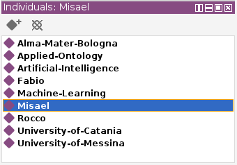
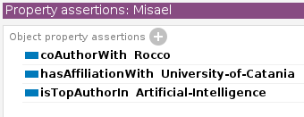

# SEMAS

This is the repository of the Python (3.7+) implementation of SEMAS (**SE**mantic **M**ulti-**A**gent **S**ystem), which integrates 
Multi-Agent systems with the Semantic Web. SEMAS is built on top of the framework [PHIDIAS](https://ceur-ws.org/Vol-2502/paper5.pdf).


# Installation

---------------

This repository has been tested on Python 3.10 64bit (Windows 10/PopOs linux), with the following packages versions:

* [PHIDIAS](https://github.com/corradosantoro/phidias) (release 1.3.4.alpha) 
* [Owlready2](https://pypi.org/project/Owlready2/) (ver. 0.26)


### PHIDIAS

---------------

```sh
> git clone https://github.com/corradosantoro/phidias
> cd phidias
> pip install -r requirements.txt
> pip install .
```


### Owlready2 

---------------

from prompt:
```sh
> pip install owlready2
```

### rdflib 

---------------

from prompt:
```sh
> pip install rdflib
```


### Starting agent

---------------

First of all, you must create the ontology. In order to do that, you must follow three preliminar steps:

* Choose the owl file name, by setting the variable FILE_NAME (ONTOLOGY Section) in the config.ini (test.owl for instance)
* Execute semas.py

```sh
Creating new test.owl file...

Please Re-Run Semas.

Process finished with exit code 0
```

* Re-execute Semas

```sh
Loading existing test.owl file...

NLP engine initializing. Please wait...

	PHIDIAS Release 1.3.4.alpha (deepcopy-->clone,micropython,py3)
	Autonomous and Robotic Systems Laboratory
	Department of Mathematics and Informatics
	University of Catania, Italy (santoro@dmi.unict.it)
	
eShell: main > 
```

Now Semas is ready.
Unless you delete the owl file or choose to create another ontology, the agent will try to load every time the specified file in confi.ini.


## SEMAS agent's **mental attitudes**

---------------
The *mental attitudes* (Beliefs, Desire and Intentions) represent respectively the **information**, **motivational** and **deliberative**
states of the agent. SEMAS aims to integrate distinct models' mental attitudes, in order to leverage all their features, by considering the following schema:


| BDI-Model  | OWL 2      | PHIDIAS    |
|------------|------------|------------|
| Beliefs    | Properties | Beliefs    |
| Desires    | Properties | Procedures |
| Intentions | Properties | Reactors   |

PHIDIAS mental attitudes are built starting from [this](https://cdn.aaai.org/ICMAS/1995/ICMAS95-042.pdf) paper, by considering the following assumptions:

1. We esplicitly represent only beliefs about *current* state of the world.
2. We represent the information about means of achieving certain future world states and the options available to the agent as *plans*, which can be viewed as a special form of beliefs.
Each plan has a *body* describing the primitive actions os subgoal that have to be achieved for plan execution to be successful. The conditions under which a plan can be chosen as an option
are specified by an *invocation condition* and (possibly) one (or more) *pre-conditions*. The invocation condition specifies the "triggering" event that is necessary for invocation of the plan,
and the pre-conditions specifies the situation that must hold for the plan to be executable.
3. Each intention that the system forms by adopting certain plans is represented implicitly using a conventional run-time stack of hierarchically related plans (similar to how Prolog interpreter
handles clauses). Multiple intentions stacks can coexist, either running in parallel, suspended until some conditions occurs, or ordered for execution in some way.

Each plan is invoked within a production rule which follows the sintax:

<p align="center"><b>[TRIGGERING EVENT] / [CONDITIONS] >> [PLAN]</b></p>


* **[TRIGGERING EVENT]**: the triggering event can be a **Belief**, a **Reactor** (a special belief which interact with production rules but without residing in the Knowledge base), or a **Procedure**
which is a way for manually trigger a corresponding rule.
* **[CONDITIONS]** (optional): one or more **Belief**, or **Active Belief** (a special belief which returns *True*/*False* on the basis of Python code execution)
* **[PLAN]**: a plan can be made of beliefs assertion/retraction or execution of high level language code invoked by instances of the PHIDIAS class **Action**. 

For more information about PHIDIAS the reader is referred [here](https://www.dmi.unict.it/santoro/teaching/sr/slides/PHIDIAS.pdf).


### OWL Beliefs, Desires, Intentions

---------------

All OWL Semantic mental attitudes are represented by classes, subclasses, individuals and their properties, under the shape of triples. All involved entities must be specified in config.ini
(which by default they describe a toy domain as case-study), in Section [CLASSES] with the variable *Entities*. All individuals are defined under the Section [INDIVIDUALS] with corresponding
items names. Beliefs, Desires and Intentions are represented with individuals properties defined in [CLASSES] and grounded as triples with variables having same name in Section [INDIVIDUALS].

### PHIDIAS correspondence for Beliefs, Desires, Intentions

---------------

As highlighted above in PHIDIAS (thus also in SEMAS) some of typical BDI features are implicitly defined. In order to create a bridge between the two models, by considering the above schema, we employ the following
heuristic:

1. **Beliefs**: Each belief can be asserted in the KB as follows (in this case the belief *SALUTATION* contains the string *Hello*), by PHIDIAS shell of inside a production rule:
```sh
> +SALUTATION("Hello")
```
Similarly, the belief can be retracted from the KB:
```sh
> -SALUTATION("Hello")
```

Since in Python code there cannot exist classes with same names but distinct usage, we are forced to choose distinct name for OWL beliefs (which are individuals properties) and PHIDIAS beliefs.
When triples are imported from OWL are asserted in the shame "TRIPLE(object, property, subject)" (for instance: *TRIPLE(Fabio, coAuthorWith, Misael)*). Afterward, a production rule system
invoked by a procedure (load) will retract such belief and assert a new one as defined in the correspondence entry in config.ini (*CoAuthorship(Fabio, Misael)*).

2. **Desires**: by convention we have chosen to represent Desires with **Procedures**, which can be used to trigger manually part of the production rules stack, taking in account (or not)
of one or more arguments.

3. **Intentions**: since PHIDIAS Intentions are implicitly represented by one or more production rules, by convention we have chosen to represent them with the PHIDIAS **Reactor**
which does not pass through the KB but it can (as like as beliefs) interact with the production rules, thus possibly execute their plan.

4. **Data linking**: all OWL-PHIDIAS mental attitudes must be linked to each other, in order to interoperate, as defined in Section [CLASSES] of config.ini (under the comments "OWL-PHIDIAS beliefs/desire/intentions linking").


### OWL Reasoning

---------------

Semas integrates the explicit declaration of SWRL rules (in Section [SWRL]), whom will interact with the ontology when the variable **ACTIVE** (in Section [REASONING]) is set to *true*.
The variable **REASONER** indicates which of the integrated reasoners (HERMIT/PELLET) must be employed before every SPARQL query in some Action's PLAN.


## Case-study: Co-Authorship and Academic Mobility

---------------
This case-study provides a formalization about interactions between Scholars in the field of Academic Mobility, in order to choose, on the basis of Co-Authorship
interaction in specific fields, the best University affiliation.


### Ontology initialization

---------------
The details of the above formalization are all defined in config.ini. Both OWL 2 ontology and PHIDIAS classes can be initialised with the command *init()* as follows:

```sh
eShell: main > init()

Initialiting Ontology...

Adding the following 1 rules to ontology: 
Rule 1: Scholar(?x), coAuthorWith(?x,?y), Scholar(?y) -> coAuthorWith(?y,?x)
Ontology saved.
```
After the *init()* procedure execution, the ontology (whose file name is defined in **FILE_NAME**, Section [ONTOLOGY] in config.ini) will be as follows:


All OWL beliefs/desires/intentions are defined by properties of individuals which are instances of subclasses of **ENTITY**. In regard of classes **BELIEF**,
**DESIRE** and **INTENTIONS**, their subclasses express the linkage with the corresponding Beliefs/Procedures/Reactors in the PHIDIAS environment.



### Ontology import

---------------

First, the PHIDIAS Knowledge Base (KB) can be inspected any time with the following command:
```sh
> kb
```

The procedure *load()* must be used to import the above ontology into the PHIDIAS environment as follows:

```sh
eShell: main > load()

Asserting all OWL 2 beliefs triples...
Asserting triples ended.
```

Such procedure triggers a production rule whose PLAN invokes an Action (assert_beliefs_triples) to query
by means SPARQL the ontology and assert all beliefs triples. Such query might include further conditions to
constrainct the results. The query execution can also be preceded by OWL reasoning (with HERMIT/PELLET).
After the ontology import, the KB's content will be as follows:


```sh
eShell: main > kb
CoAuthorship('Fabio', 'Misael')         CoAuthorship('Misael', 'Rocco')         
Affiliation('Misael', 'University-of-Catania')Affiliation('Rocco', 'Alma-Mater-Bologna')
TopAuthorship('Fabio', 'Artificial-Intelligence')TopAuthorship('Misael', 'Artificial-Intelligence')
TopAuthorship('Rocco', 'Applied-Ontology')Selectionship('Fabio', 'University-of-Catania')
```

In case of active inference with PELLET/HERMIT before the SPARQL query, the outcome after *load()* 
will be as follows, by the virtue of the defined SWRL rule which specifies the simmetric mutual Coauthorship.

```sh
eShell: main > kb
CoAuthorship('Misael', 'Fabio')         CoAuthorship('Fabio', 'Misael')         
CoAuthorship('Rocco', 'Misael')         CoAuthorship('Misael', 'Rocco')         
Affiliation('Misael', 'University-of-Catania')Affiliation('Rocco', 'Alma-Mater-Bologna')
TopAuthorship('Fabio', 'Artificial-Intelligence')TopAuthorship('Misael', 'Artificial-Intelligence')
TopAuthorship('Rocco', 'Applied-Ontology')Selectionship('Fabio', 'University-of-Catania')
```

### SEMAS inference

---------------
To achieve inference, one of the defined DESIRES must be employed as PHIDIAS Procedure, which are: *Publicationship()*
and *BeTopAuthorship()*. Both of them can be used with one or more arguments. For instance, supposing one want
to publish in the field of *Applied Ontology* a minimal usage is: *Publicationship("Applied-Ontology")*, whom will match (or not) with
the following defined rule in [front_end.py](front_end.py): <br>

```sh
Publicationship(X) / (CoAuthorship(Z, Y) & TopAuthorship(Y, X) & Affiliation(Z, U)) >> [show_line("Indirect match found at ",U,".\n"), -CoAuthorship(Z, Y), +ProposeCoauthorship(Z, X), Publicationship(X)]
Publicationship(X) / (TopAuthorship(Y, X) & Affiliation(Y, U)) >> [show_line("Direct match found at ",U,".\n"), -TopAuthorship(Y, X), +ProposeCoauthorship(Y, X), Publicationship(X)]

+ProposeCoauthorship(X, Y) >> [show_line("Propose co-authorship with ",X," to publish in the field of ",Y,".\n")]
```

the outcome will be as follows:

```sh
eShell: main > Publicationship("Applied-Ontology")

Indirect match found at University-of-Catania.

Direct match found at Alma-Mater-Bologna.

Propose co-authorship with Misael to publish in the field of Applied-Ontology.

Propose co-authorship with Rocco to publish in the field of Applied-Ontology.
```

